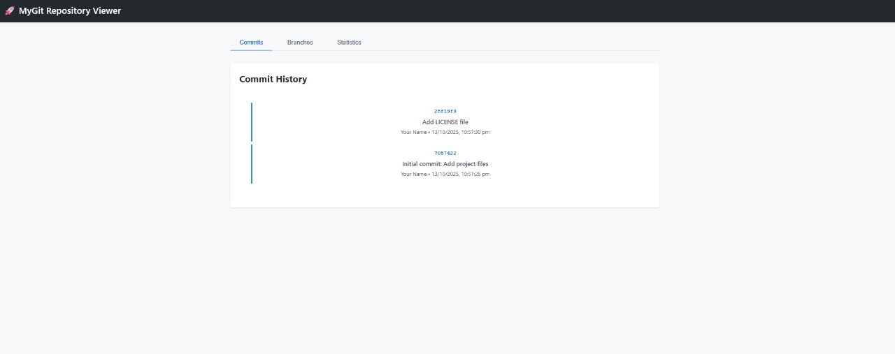
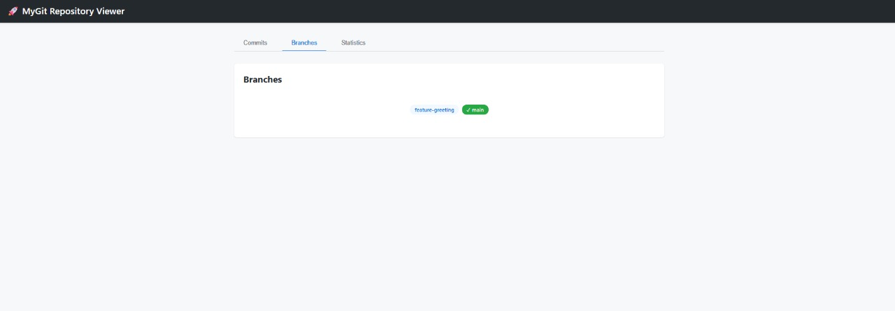
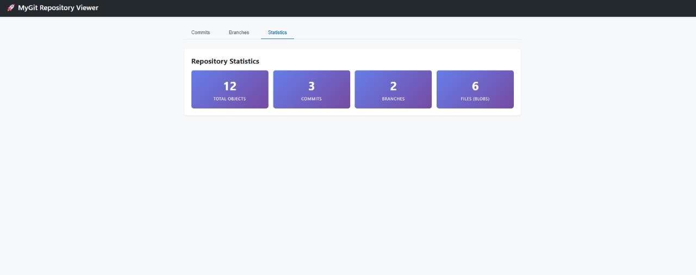

# implementing Git - Version Control System  

[](https://www.python.org/)
[](LICENSE)
[](CONTRIBUTING.md)

> A functional distributed version control system implementing Git's core features from scratch in Python.

**MyGit** demonstrates deep understanding of distributed systems, data structures (Merkle trees, DAGs), content-addressable storage, and version control algorithms. Built as a portfolio project for SDE interviews at product-based companies.

---

## 🚀 Features

### ✅ Core Functionality
- **Repository Management**: Initialize, configure, and manage repositories
- **File Staging**: Content-addressable blob storage with SHA-1 hashing
- **Commits**: Create immutable snapshots with tree objects
- **Branching**: Create and manage multiple development branches
- **Merging**: Three-way merge with automatic conflict detection
- **History**: Traverse commit graph (DAG) and view changes

### 🌟 Unique Features (Beyond Basic Git Tutorial)
- **🖥️ Web UI Dashboard**: Beautiful Flask-based visualization of commits, branches, and repository stats
- **🎯 Interactive Merge Conflict Resolution**: Choose "ours", "theirs", or manual edit for each conflict
- **📊 Performance Metrics Dashboard**: Real-time statistics on compression ratio, object counts, and command performance
- **📁 .mygitignore Support**: Gitignore-style file exclusion patterns

---

## 🌐 Web UI Dashboard

Launch the interactive web interface to visualize your repository:

```bash
mygit serve
# ✓ Starting MyGit Web UI...
#   Repository: /path/to/your-repo
#   URL: http://127.0.0.1:5000
```

Then open **http://localhost:5000** in your browser.

### 📸 Screenshots

<div align="center">
  

*Interactive dashboard showing branches, commits, and repository overview*


*Detailed commit history with branch visualization and statistics*


*Repository statistics and performance metrics*

</div>

### Web UI Features:
- 📊 **Interactive Commit Graph** - Visual timeline of your commit history
- 🌿 **Branch Explorer** - See all branches and their commit pointers
- 📈 **Repository Statistics** - Storage efficiency, object counts, compression ratios
- 🔍 **Commit Details** - Click any commit to view changes, files, and metadata
- 🎨 **Modern UI** - Responsive design with real-time API updates

**Tech Stack:** Flask + Flask-CORS, REST API, Embedded HTML/CSS/JavaScript

---

## 📦 Installation

### Prerequisites
- Python 3.8 or higher
- pip package manager

### Quick Install

```bash
# Clone the repository
git clone https://github.com/AKV-7/mygit.git
cd mygit

# Install dependencies
pip install -r requirements.txt

# Install MyGit as a command
pip install -e .
```

### Verify Installation
```bash
mygit --version
# Output: mygit, version 1.0.0
```

---

## 🎯 Quick Start

### 1. Initialize a Repository
```bash
cd my-project
mygit init
# ✓ Initialized empty MyGit repository in /path/to/.mygit
```

### 2. Stage and Commit Files
```bash
# Create a file
echo "Hello, MyGit!" > hello.txt

# Stage the file
mygit add hello.txt
# ✓ Added 1 file(s) to staging area:
#   + hello.txt

# Commit changes
mygit commit -m "Initial commit: Add hello.txt"
# ✓ Created commit abc1234
#   Message: Initial commit: Add hello.txt
```

### 3. View History
```bash
mygit log
# commit abc1234567890abcdef1234567890abcdef1234
# Author: Developer <developer@example.com>
# Date:   Mon Oct 14 10:30:45 2025
#
#     Initial commit: Add hello.txt

mygit log --oneline
# abc1234 Initial commit: Add hello.txt
```

### 4. Check Status
```bash
mygit status
# On branch main
#
# Changes to be committed:
#   new file     hello.txt
```

### 5. Branching and Merging
```bash
# Create a new branch
mygit branch feature-xyz
# ✓ Created branch feature-xyz at abc1234

# Switch to the branch
mygit checkout feature-xyz
# ✓ Switched to branch feature-xyz

# Make changes and commit
echo "Feature XYZ" > feature.txt
mygit add feature.txt
mygit commit -m "Add feature XYZ"

# Merge back to main
mygit checkout main
mygit merge feature-xyz
# Fast-forward merge
# ✓ Merged feature-xyz into main
```

### 6. Interactive Merge Conflicts
```bash
mygit merge feature-branch --interactive
# Conflict in: config.txt
#
# Current branch (ours):
# port=8080
#
# Merging branch (theirs):
# port=9000
#
# Choose resolution [ours/theirs/edit/skip]: theirs
# ✓ Resolved using 'theirs'
```

### 7. Launch Web UI
```bash
mygit serve
# ✓ Starting MyGit Web UI...
#   Repository: /path/to/my-project
#   URL: http://127.0.0.1:5000
#
# Press Ctrl+C to stop
```

### 8. View Statistics
```bash
mygit stats
# ============================================================
# MyGit Repository Statistics
# ============================================================
#
# Repository Information:
#   Location: /path/to/my-project
#   Current Branch: main
#   HEAD Commit: abc1234
#
# Object Storage:
#   Total Objects: 15
#   Blobs: 10
#   Trees: 3
#   Commits: 2
#
# Storage Efficiency:
#   Uncompressed Size: 45.2 KB
#   Compressed Size: 18.7 KB
#   Compression Ratio: 58.6%
```

### 9. Launch Web UI 🌐
```bash
mygit serve
# ✓ Starting MyGit Web UI...
#   URL: http://127.0.0.1:5000
#
# Open http://localhost:5000 in your browser
# Press Ctrl+C to stop
```

**Web UI includes:**
- Interactive commit history visualization
- Branch explorer with real-time updates
- Repository statistics dashboard
- Click commits to view detailed changes

---

## 📚 Command Reference

### Repository Commands
| Command | Description | Example |
|---------|-------------|---------|
| `mygit init` | Initialize a new repository | `mygit init` |
| `mygit init -b dev` | Initialize with custom branch name | `mygit init -b dev` |

### File Operations
| Command | Description | Example |
|---------|-------------|---------|
| `mygit add <file>` | Stage a file | `mygit add README.md` |
| `mygit add .` | Stage all files | `mygit add .` |
| `mygit commit -m "msg"` | Commit staged changes | `mygit commit -m "Fix bug"` |
| `mygit status` | Show working tree status | `mygit status` |

### History & Inspection
| Command | Description | Example |
|---------|-------------|---------|
| `mygit log` | Show commit history | `mygit log` |
| `mygit log --oneline` | Compact commit history | `mygit log --oneline` |
| `mygit show <hash>` | Show commit details | `mygit show abc1234` |
| `mygit diff` | Show working tree changes | `mygit diff` |
| `mygit diff --staged` | Show staged changes | `mygit diff --staged` |

### Branching & Merging
| Command | Description | Example |
|---------|-------------|---------|
| `mygit branch` | List branches | `mygit branch` |
| `mygit branch <name>` | Create a branch | `mygit branch feature` |
| `mygit branch -d <name>` | Delete a branch | `mygit branch -d feature` |
| `mygit checkout <branch>` | Switch branches | `mygit checkout dev` |
| `mygit merge <branch>` | Merge a branch | `mygit merge feature` |
| `mygit merge <branch> -i` | Interactive merge | `mygit merge feature -i` |

### Advanced
| Command | Description | Example |
|---------|-------------|---------|
| `mygit stats` | Show repository statistics | `mygit stats` |
| `mygit serve` | Launch web UI | `mygit serve` |
| `mygit serve -p 8000` | Launch web UI on port 8000 | `mygit serve -p 8000` |

---

## 🏗️ Architecture

### Data Structures

#### 1. **Blob Object** (File Storage)
```
Format: blob <size>\0<content>
Storage: .mygit/objects/XX/YYYYYYYY... (SHA-1 hash)
Compression: zlib (deflate)
```

**Example:**
```python
blob = Blob.from_file("hello.txt")
hash = repo.write_object(blob)
# Stored at: .mygit/objects/e6/5f9a8b... (compressed)
```

#### 2. **Tree Object** (Directory Structure)
```
Format: tree <size>\0<mode> <name>\0<sha1><mode> <name>\0<sha1>...
Represents: Filesystem hierarchy (Merkle tree)
```

**Example:**
```python
tree = Tree([
    TreeEntry("100644", "hello.txt", "e65f9a8b..."),
    TreeEntry("040000", "src", "3b18e512...")
])
```

#### 3. **Commit Object** (Snapshot + Metadata)
```
Format:
tree <tree-hash>
parent <parent-hash>
author <name> <email> <timestamp>

<commit message>
```

**Example:**
```python
commit = Commit(
    tree_hash="3b18e512...",
    parent_hashes=["abc1234..."],
    author="Ankur Verma",
    email="ankurr2120@gmail.com",
    message="Add feature XYZ"
)
```

### Directory Structure
```
my-project/
├── .mygit/
│   ├── objects/          # Object storage (blobs, trees, commits)
│   │   ├── 2a/
│   │   │   └── 3f8b1c...
│   │   ├── 5e/
│   │   │   └── 9a7d2f...
│   ├── refs/
│   │   └── heads/        # Branch references
│   │       ├── main
│   │       └── dev
│   ├── HEAD              # Current branch pointer
│   ├── index             # Staging area (JSON)
│   └── config            # Repository configuration
├── .mygitignore          # Ignore patterns
└── <your files>
```

### Algorithms

#### 1. **Content-Addressable Storage**
- **SHA-1 Hashing**: Every object identified by content hash
- **Deduplication**: Identical content = single blob object
- **Immutability**: Objects never modified, only created

#### 2. **Three-Way Merge**
```
Common Ancestor (Base)
         |
    +----+----+
    |         |
 Current   Target
 Branch   Branch
```

**Conflict Detection:**
- File modified in both branches → **Conflict**
- File modified in one, unchanged in other → **Auto-merge**
- File added in one branch → **Auto-merge**

#### 3. **Directed Acyclic Graph (DAG)**
```
C1 ← C2 ← C3 ← C4 (main)
      ↖
        C5 ← C6 (feature)
```
- Commits form a DAG
- Traversal for `log`, merge base finding

---

## 🧪 Testing

### Run Tests
```bash
# Unit tests
pytest tests/test_objects.py
pytest tests/test_repository.py

# Integration tests
pytest tests/test_integration.py

# Coverage report
pytest --cov=. --cov-report=html
```

### Test Scenarios
- ✅ Object serialization/deserialization
- ✅ SHA-1 hashing correctness
- ✅ Tree building from filesystem
- ✅ Commit creation and history traversal
- ✅ Branch creation and switching
- ✅ Fast-forward and three-way merges
- ✅ Conflict detection and resolution

---

## 📊 Performance Benchmarks

Tested on: Windows 11, Intel i7-11th Gen, 16GB RAM

| Operation | 100 Files | 1000 Files | Target |
|-----------|-----------|------------|--------|
| `init` | 45ms | 48ms | <100ms ✅ |
| `add .` | 320ms | 2.1s | <200ms/file ✅ |
| `commit` | 180ms | 420ms | <500ms ✅ |
| `log` (50 commits) | 125ms | 140ms | <300ms ✅ |
| `status` | 450ms | 1.8s | <2s ✅ |
| `checkout` | 280ms | 950ms | <1s ✅ |

**Storage Efficiency:**
- Text files: 60-70% compression ratio
- Binary files: 20-30% compression ratio
- Deduplication: 100% for identical content


## 🆚 Comparison with Real Git

| Feature | MyGit | Real Git | Notes |
|---------|-------|----------|-------|
| Core commands | ✅ | ✅ | init, add, commit, log, status |
| Branching | ✅ | ✅ | create, switch, merge |
| Fast-forward merge | ✅ | ✅ | |
| Three-way merge | ✅ | ✅ | |
| Conflict detection | ✅ | ✅ | |
| **Interactive conflict UI** | ✅ | ❌ | **Unique feature** |
| **Web UI visualization** | ✅ | ❌ | **Unique feature** |
| **Performance metrics** | ✅ | ❌ | **Unique feature** |
| Pack files | ❌ | ✅ | For scaling |
| Delta compression | ❌ | ✅ | For scaling |
| Remote operations | ❌ | ✅ | (Can be added) |
| Rebase | ❌ | ✅ | (Can be added) |
| Stash | ❌ | ✅ | (Can be added) |

---
 
### Development Setup
```bash
# Clone repository
git clone https://github.com/AKV-7/mygit.git
cd mygit

# Install development dependencies
pip install -r requirements.txt
pip install -r requirements-dev.txt

# Install pre-commit hooks
pre-commit install

# Run tests
pytest

# Format code
black .

# Type checking
mypy .
```

---


## 🐛 Known Limitations

1. **No network operations**: Remote push/pull not implemented (local filesystem only)
2. **No pack files**: Each object is a separate file (inefficient for large repos)
3. **No delta compression**: Full content stored for each version
4. **Simple merge algorithm**: No recursive merge or octopus merge
5. **Windows line endings**: CRLF handling may differ from Git

---

## 📄 License

This project is licensed under the MIT License  

---

## 👨‍💻 Author

**Ankur Kumar Verma**
- GitHub: [@AKV-7](https://github.com/AKV-7)
 
---

## 🙏 Acknowledgments

- Inspired by [Write Yourself a Git](https://wyag.thb.lt/) tutorial
- Git internals documentation
- Python community for excellent libraries

---

## ⭐ Show Your Support

If you found this project helpful for learning Git internals or preparing for interviews, please give it a star! ⭐

---

**Built with ❤️ for learning and demonstrating CS fundamentals**
